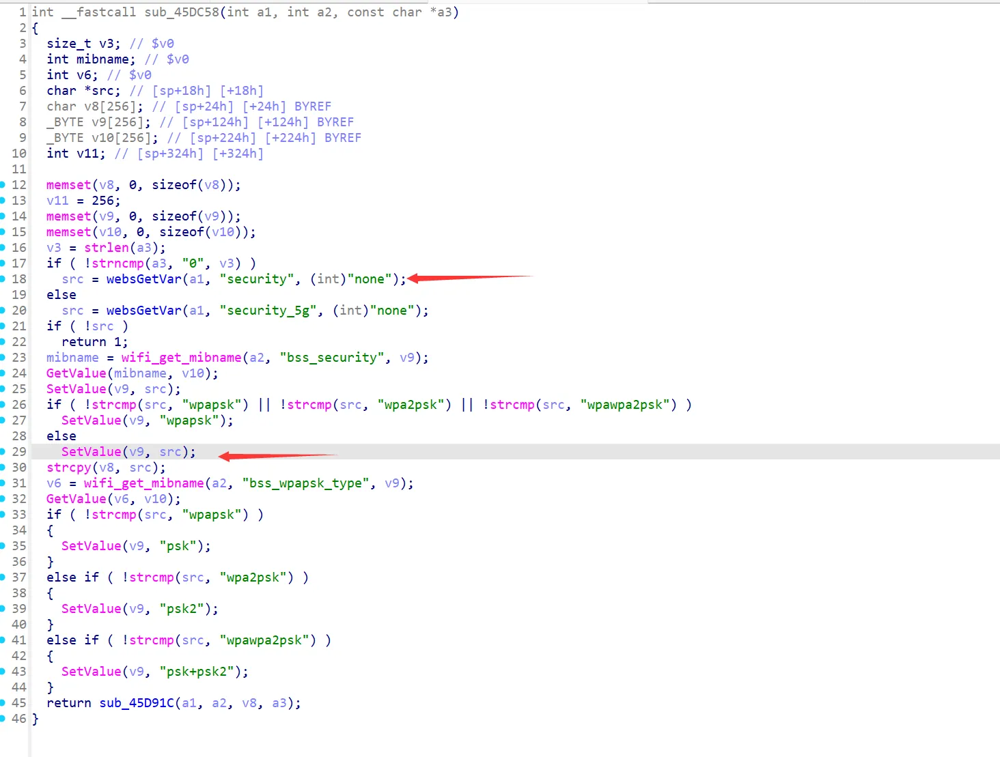

# Logical Vulnerability in AC Series Routers  

This vulnerability has been confirmed through real-world testing on AC8v4 V16.03.34.06.  
Firmware download link: https://tenda.com.cn/material/show/3518  

## Example of Vulnerability Impact  
In scenarios where multiple users simultaneously log in to an AC series router with this vulnerability, a malicious user can exploit it to:  
1. Change the router from a password-protected mode to an open (password-free) connection state.  
2. Disconnect all devices connected to the router.  

## Vulnerability Analysis  
In the `/goform/WifiBasicSet` endpoint, the `formWifiBasicSet` function calls `sub_45F3E8`, which proceeds through the following functions:  
`sub_45F3E8 -> sub_45E1C4 -> sub_45DC58`  

When accessing `/goform/WifiBasicSet` without setting any parameters, the `security` parameter defaults to "none". This triggers the `else` statement at line 28, setting `bss_security` to "none". As a result:  
- The router becomes accessible without a password.  
- All connected devices are disconnected and need to reconnect.  

## Vulnerability Reproduction  
To reproduce the vulnerability:  
1. Connect to any AC series router with this vulnerability.  
2. Access the Tenda router management interface.  
3. Visit the following POC link in a browser:  
   `http://tendawifi.com/goform/WifiBasicSet`
